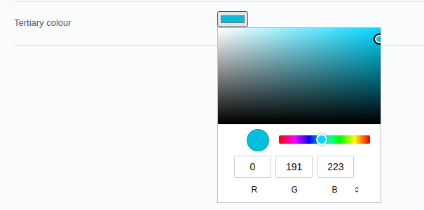

# Input examples

> Note: the inputs are rendered by the browser native controls

## Colour field

> [Support Matrix](https://caniuse.com/input-color)

+ This field only supports 6chr hex values as per the W3C spec.

```php
<?php
// or ColorField if you are en-us
$fields->addFieldToTab(
        'Root.Main',
        ColourField::create('TertiaryColour')
);
```

### Example HTML

```html
<input type="color" id="field" name="field" value="#00bedf">
```

Chrome example:



<hr>

With a `<datalist>`, although note that browsers will allow other colours to be picked:

```html
<input type="color" id="field" name="field" value="#00bedf" list="colours">
<datalist id="colours">
  <option>#ff0000</option>
  <option>#0000ff</option>
  <option>#00ff00</option>
  <option>#ffff00</option>
  <option>#00ffff</option>
</datalist>
```

No need for fancy JS pickers when the browser can do it just as easily. Non supporting browsers will fallback to a text input field.

### Nullable colour field

Colour inputs do not allow a null/empty value to be selected. To allow empty values, use the core `NullableField` together with a `ColourField`, or implement a separate checkbox field:

```php
<?php
$nullableColourField = \SilverStripe\Forms\NullableField::create(
    \Codem\Utilities\HTML5\ColourField::create(
        "CustomColour", "Custom colour"
    ),
    "None"
);
```

You will need to apply layout/styling and data handling in your own project.

## URL Field

A good starting point is the `URLFieldTest` class:

```php
<?php
$url = 'ftp://www.example.com/path?foo=bar';
$field = UrlField::create('TestURL', 'Test URL', $url);
$pattern = "^ftp://.+\.com";
$phpPattern = "|^ftp://.+\.com|";
$field->setPattern($pattern, $phpPattern);
```

### Methods available

+ `setRequiredParts` - provide an array of URL parts the URL must have for validation to pass, the values being the keys from `parse_url()`
+ `setPattern` - set complex and mystifying URL regular expression patterns in both JS and PHP
+ `setSchemes` - set an array of schemes that the URL must start with (eg. `['blob', 'dict', 'dns']`)
+ `restrictToHttp` - shorthand method, the URL must start with http:// OR https://
+ `restrictToHttps` - shorthand method, the URL must start with https://


## Traits

The fields use relevant traits based on their allowed attributes:

+ Datalist: for inputs that allow a HTMLDataListElement to be attached
+ MinMax: for inputs that have a min or max
+ Multiple: for inputs that allow multiple selections
+ Pattern: for inputs that support the pattern attribute
+ Step: for inputs that support the step attribute
+ Core: a set of methods for core attributes for all inputs

See the RangeField for an example of usage.
